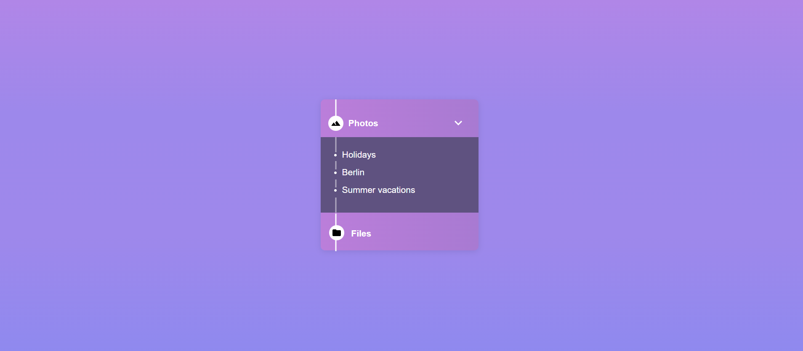

# loop2step3
*An implementation of Media Timeline Card Page with HTML/CSS*

## Getting Started
Clone or download this repository and run with a local server of open index.html with your favorite browser

## Prequisite
- Your browser version must be recent for a better experience

## Features
- Media Timeline Card Page

## Tech/framework used
- HTML
- CSS

## Demo
[Preview Here](https://rawcdn.githack.com/Hawa-codes/Loop2-step3/refs/heads/main/index.html)

## Contact
If you want to contact me you can reach me at
-hawaadediran345@gmail.com
-https://github.com/Hawa-codes

## Addtional Info
- This is not meant for production. It's for learning purpose only